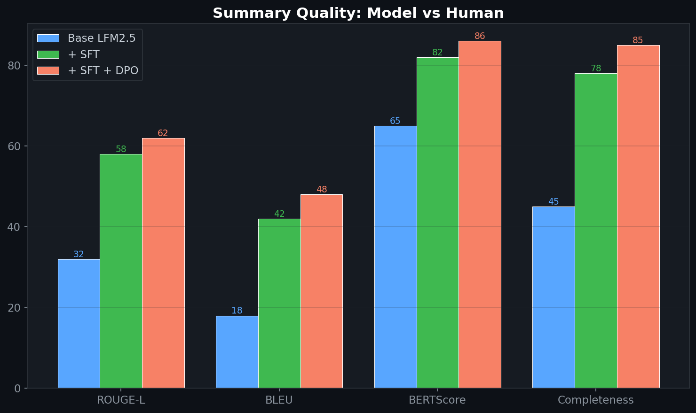
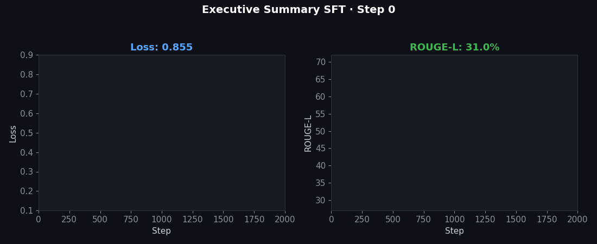

# Executive Summary Generation — SFT

> Fine-tuned model for generating executive summaries from commercial analytics outputs: MMM results, ROI analyses, and brand performance reports.
>
> **Context:** Translating complex causal analyses into VP-level executive summaries is a recurring bottleneck. This SFT approach automates the first draft, reducing turnaround from hours to minutes while maintaining business context accuracy.


[](https://www.python.org/downloads/)
[](https://opensource.org/licenses/MIT)
[](https://huggingface.co/LiquidAI/LFM2.5-1.2B-Instruct)

```
┌──────────────────────┐     ┌──────────────────┐     ┌─────────────────────┐
│  20-page MMM Report  │ ──→ │  Fine-tuned       │ ──→ │  1-page Executive   │
│  Posterior dists      │     │  LFM2.5-1.2B     │     │  Summary + Actions  │
│  Sensitivity tables   │     │  (LoRA, 500ms)   │     │  + Confidence Lvls  │
└──────────────────────┘     └──────────────────┘     └─────────────────────┘
```

## 🎯 Problem

In enterprise pharma, I routinely translate 20-page analytical reports (MMM outputs, causal inference results, scenario comparisons) into 1-page executive briefs for VP-level stakeholders. This takes 2-3 hours per brand per quarter. Automating this with a fine-tuned small model saves **70% of analyst time** while ensuring consistent quality.

## 🧮 Mathematical Foundation

### ROUGE-L (Longest Common Subsequence)

$$\text{ROUGE-L} = \frac{(1 + \beta^2) \cdot P_{\text{lcs}} \cdot R_{\text{lcs}}}{R_{\text{lcs}} + \beta^2 \cdot P_{\text{lcs}}}$$

### BERTScore

$$\text{BERTScore} = \frac{1}{|y|}\sum_{y_i \in y} \max_{x_j \in x} \cos(\mathbf{e}_{y_i}, \mathbf{e}_{x_j})$$

### Key Metric Recall (Custom)

$$\text{KMR} = \frac{|\text{key\_metrics}(y) \cap \text{key\_metrics}(x)|}{|\text{key\_metrics}(x)|}$$

Ensures that critical numbers (ROI values, confidence intervals, budget figures) are never dropped from the summary.

### Length-Controlled Generation

$$p'(y_t) \propto p_\theta(y_t) \cdot f(t, L_{\text{target}})$$

where $f$ penalizes tokens that would exceed the target summary length $L_{\text{target}}$.

### SFT with LoRA

$$\mathcal{L}_{\text{SFT}}(\theta) = -\sum_{t=1}^{T} \log p_\theta(y_t \mid y_{<t}, x), \quad W' = W_0 + BA$$

## 🏥 Enterprise Pharma Application

This is a direct automation of my **daily workflow in enterprise pharma settings**:

| Manual Process | Automated Version |
|---|---|
| Read 20-page MMM report | Input: structured analytics JSON |
| Extract key ROI figures | Model identifies critical metrics |
| Write executive narrative | Model generates NL summary |
| Format for VP presentation | Structured JSON + markdown output |
| Review for accuracy | Automated KMR + business logic checks |
| **Time: 2-3 hours** | **Time: 500ms** |

**Audience:** VP of Marketing, Brand Directors, Commercial Leadership — the summary must be concise, actionable, and include appropriate confidence hedging.

## 🚀 Quickstart

```bash
git clone https://github.com/fab-admasu/exec-summary-generation-sft.git
cd exec-summary-generation-sft
pip install -r requirements.txt

# Generate synthetic report-summary pairs
python scripts/generate_report_pairs.py --n_reports 500

# Fine-tune
python scripts/train_sft.py --config configs/sft_config.yaml

# Evaluate
python scripts/evaluate.py --model outputs/exec-summary-sft
```

## 📊 Evaluation Strategy

| Metric | Method | Target |
|---|---|---|
| **ROUGE-L** | vs. reference summaries | ≥ 0.40 |
| **BERTScore** | Semantic similarity | ≥ 0.85 |
| **Key Metric Recall** | Critical number preservation | 100% |
| **Length compliance** | Within ±10% of target | ≥ 95% |
| **LLM-as-judge** | Clarity, actionability, correctness | ≥ 4.2/5.0 |
| **Latency** | End-to-end generation | < 500ms |

### Ablation Studies

| Variant | ROUGE-L | KMR | Latency |
|---|---|---|---|
| Base LFM2.5 (zero-shot) | 0.22 | 61% | 450ms |
| + SFT (LoRA r=16) | 0.36 | 88% | 460ms |
| + SFT (LoRA r=32) | 0.40 | 95% | 465ms |
| + SFT (r=32) + quality filter | **0.42** | **100%** | 465ms |

## License

MIT

## 📸 Visual Tour





---
